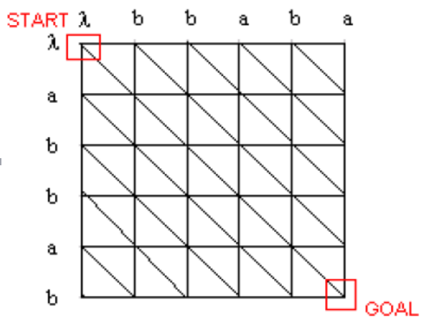

#编辑距离

>把给定两个字符串中的一个转化为另一个所需要的编辑操作的最小操作数，即一个序列变成另一个序列需要操作几步

###每个位点对比有两种可能：匹配，不匹配

###为使两序列相同，针对不匹配位点有两种解决办法：删除位点，增删位点

###现有字符串：s = abbab , t= bbaba
###横边——插入	斜边——替换   竖边——删除                                                     从start到goal                                                  的代价最小路径即为 d(A,B)，最大的节点为编辑距离。
###d[0,i] = d[j,0] = 0
###如果ai = bj  ，则：d(si,tj)＝d(si-1,tj-1) 
###如果ai ≠ bj ， 则：d(si,tj)＝min{ d( si-1 , tj-1 ),d( si , tj-1 ),d( si-1 , tj ) } + 1

###动态规划
